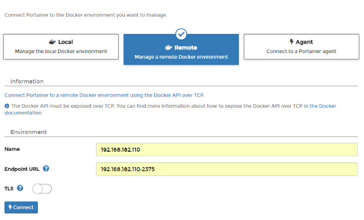
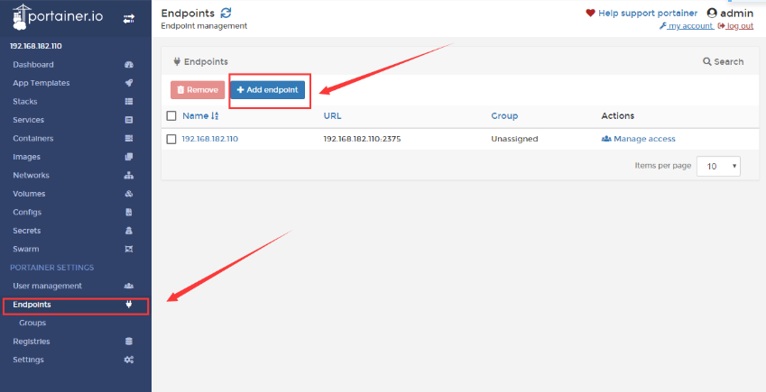

# Docker部署Portainer

## 单机版
部署运行
```
docker run -d -p 9000:9000 \
    --restart=always \
    -v /var/run/docker.sock:/var/run/docker.sock \
    --name prtainer-test \
    portainer/portainer
```

## 集群版
1. 部署运行
```
docker run -d -p 9000:9000 --restart=always --name prtainer-test portainer/portainer
```
2. 选择Remote

3. 添加节点

