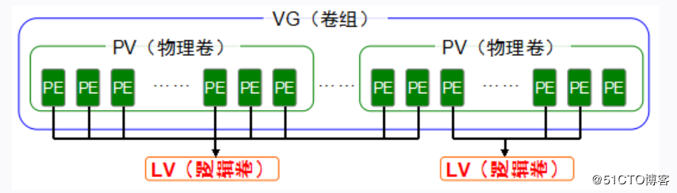

# Linux磁盘管理LVM
## 一. LVM简介
> LVM(Logical Volume Manager)逻辑卷管理是在Linux2.4内核以上实现的磁盘管理技术。它是Linux环境下对磁盘分区进行管理的一种机制。现在不仅仅是Linux系统上可以使用LVM这种磁盘管理机制，对于其它的类UNIX操作系统，以及windows操作系统都有类似与LVM这种磁盘管理软件。
> LVM的工作原理其实很简单，它就是通过将底层的物理硬盘抽象的封装起来，然后以逻辑卷的方式呈现给上层应用。在传统的磁盘管理机制中，我们的上层应用是直接访问文件系统，从而对底层的物理硬盘进行读取，而在LVM中，其通过对底层的硬盘进行封装，当我们对底层的物理硬盘进行操作时，其不再是针对于分区进行操作，而是通过一个叫做逻辑卷的东西来对其进行底层的磁盘管理操作。比如说我增加一个物理硬盘，这个时候上层的服务是感觉不到的，因为呈现给上次服务的是以逻辑卷的方式。

## 二. LVM 利弊
### 优点
* 可以在系统运行的状态下动态的扩展文件系统的大小。
          在Linux操作系统中我们的磁盘管理机制和Windows上的都差不多，绝大多数都是使用MBR(Master Boot Recorder)都是通过先对一个硬盘进行分区，然后再将该分区进行文件系统的格式化，在Linux系统中如果要使用该分区就将其挂载上去即可，windows的话其实底层也就是自动将所有的分区挂载好，然后我们就可以对该分区进行使用了。
         可这样做的话会带来很多问题，比如我们使用的一个分区所剩空间大小已经不够使用了，这个时候我们没法对分区进行扩充，我们只能通过增加硬盘，然后在新的硬盘上创建分区，对分区进行格式化，然后将之前分区的所有东西都拷贝到新的分区里面才行。但是新增加的硬盘是作为独立的文件系统存在的，原有的文件系统并没有得到任何的扩充，上层应用只能访问到一个文件系统。这样的方式对个人的电脑来说可能还能接受，但是如果对于生产环境下的服务器来说，这是不可接受的。因为如果要把一个分区的内容都拷贝到另一个分区上去，势必要首先卸载掉之前的那个分区，然后再对整个分区进行拷贝，如果服务器上运行着一个重要的服务，要求是 7*24 小时运行正常的，那么卸载掉分区这是不可想象的，同时如果该分区保存的内容非常非常的多，那么在对分区进行转移时时间可能会耗费很久，所以，这个时候我们就会受到传统磁盘管理的限制，因为其不能够进行动态的磁盘管理。因此，为了解决这个问题，LVM技术就诞生了！这也是LVM最大的优点。
* 文件系统可以跨多个磁盘，因此文件系统大小不会受物理磁盘的限制。
* 可以增加新的磁盘到LVM的存储池中。
* 可以以镜像的方式冗余重要的数据到多个物理磁盘。
* 可以方便的导出整个卷组到另外一台机器。
### 缺点
* 在从卷组中移除一个磁盘的时候必须使用reducevg命令（这个命令要求root权限，并且不允许在快照卷组中使用）。
* 当卷组中的一个磁盘损坏时，整个卷组都会受到影响。
* 因为加入了额外的操作，存贮性能受到影响。
## 三. LVM 架构图

如图所示就是LVM的基本组成
* PV(Physical Volume)：物理卷，处于LVM最底层，可以是物理硬盘或者分区。
* PP(Physical Extend)：物理区域，PV中可以用于分配的最小存储单元，可以在创建PV的时候制定（默认为4MB），如1M, 2M, 4M, 8M, 32M, 64M…组成同一VG中所有PV的PE大小应该相同。
* VG(Volume Group)：卷组，建立在PV之上，可以含有一个到多个PV。
* LV(Logical Volume)：逻辑卷，建立在VG之上，相当于原来分区的概念。不过大小可以动态改变。

## 四. LVM 使用
1. 在新分区上创建PV
```bash
# 创建PV
sudo pvcreate /dev/nvme1n1
# 查看PV列表
sudo pvs
sudo pvdisplay
```

2. 创建VG组，并将PV划入该VG组
```bash
# sudo vgcreate data_vg /dev/nvme1n1[pv...]
sudo vgcreate data_vg /dev/nvme1n1 
```

3. 创建LV，并将data_vg划入，使用所有空闲空间
```bash
# 创建LV，将data_vg所有空闲空间划入，命名data
sudo lvcreate -l 100%FREE -n data data_vg  
# 查看LV
sudo lvs
sudo lvdisplay #可获取LV路径
```
* 参数： -l 设置空间大小
* 参数：-n 设置LV名称
4. 初始化LV
```bash
# 格式化LV，文件系统设置为xfs
sudo mkfs.xfs /dev/data_vg/data
```
5. 挂载LV
```bash
sudo mount /dev/data_vg/data /mnt
```