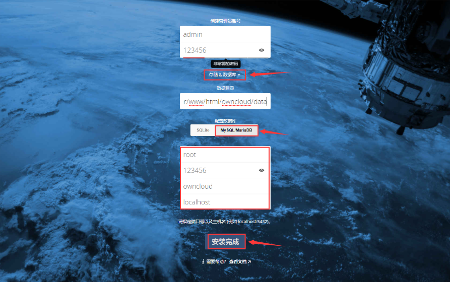
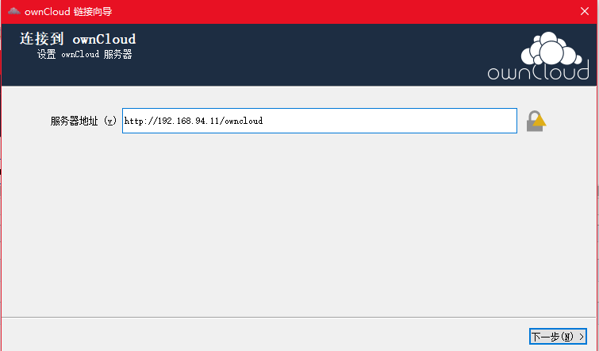
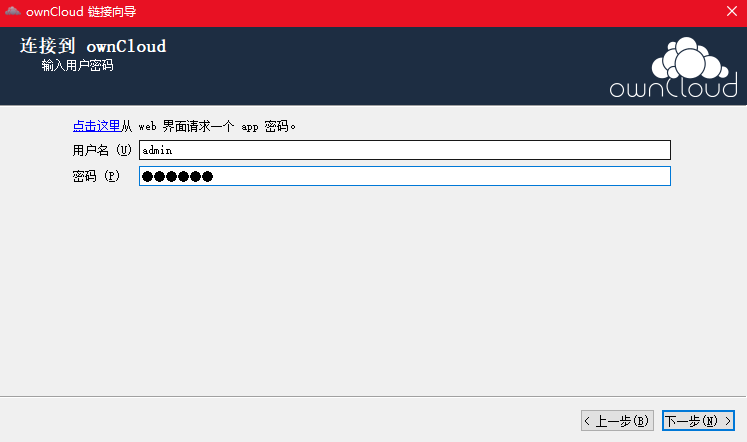

# 搭建私有云owncloud
## 0x01 环境
1. 系统：CentOS7.0+
2. 软件：Docker
## 0x02 搭建
### 1. 安装Mysql
* 创建外部映射目录
```bash
mkdir -p /data/docker-data/mysql/conf
mkdir -p /data/docker-data/mysql/logs
mkdir -p /data/docker-data/mysql/data
```
* 创建并运行Mysql容器
```
docker run -p 9306:3306 --name mysql -v /data/docker-data/mysql/conf:/etc/mysql/conf.d -v /data/docker-data/mysql/logs:/logs -v /data/docker-data/mysql/data:/var/lib/mysql -e MYSQL_ROOT_PASSWORD=jutao110 --restart=always -d mysql:5.7.27 --character-set-server=utf8mb4 --collation-server=utf8mb4_unicode_ci --lower_case_table_names=1 
```
### 2. 安装owncloud
* 拉取owncloud镜像
```
docker pull owncloud
```
* 映射owncloud容器存储目录 
```
mkdir -p /data/docker-data/owncloud
```
* 运行owncloud容器
```
docker run --name owncloud -d -v /data/docker-data/owncloud:/var/www/html/data -p 9002:80 owncloud
```

### 3. 设置owncloud
* 访问 9002 端口，owncloud的Web管理页面，并设置数据库，创建管理员

* 创建普能用户并访问
### 4. 使用客户端访问
* [客户端下载地址](https://owncloud.org/install/#install-clients)，也可查看附件
* 设置服务器地址，地址为服务访问地址

* 设置用户名密码，根据图中的"点击这里"，进入网站，创建APP私钥，并使用


## 0x03 DockerCompose构建文件
```yml
version: "3.5"
services: 
  mysql:
    image: mysql:5.7.27
    container_name: "mysql"
    expose:
      - "3306"
    ports:
      - "9306:3306"
    volumes:
      - /data/docker-data/mysql/conf:/etc/mysql/conf.d
      - /data/docker-data/mysql/logs:/logs
      - /data/docker-data/mysql/data:/var/lib/mysql
    dns:
      - 8.8.8.8
      - 114.114.114.114
    environment:
      LANG: zh_CN.UTF-8
      MYSQL_ROOT_PASSWORD: jutao110
    command: --character-set-server=utf8mb4 --collation-server=utf8mb4_unicode_ci --lower_case_table_names=1
    restart: always
    deploy:
      replicas: 1
    networks:
      cloud_network: 
        ipv4_address: 192.168.0.5

  owncloud:
    image: owncloud
    container_name: "owncloud"
    expose:
      - "80"
    ports:
      - "9002:80"
    volumes:
      - /data/docker-data/owncloud:/var/www/html/data
    dns:
      - 8.8.8.8
      - 114.114.114.114
    environment:
      LANG: zh_CN.UTF-8
    restart: always
    deploy:
      replicas: 1
    networks:
      cloud_network: 
        ipv4_address: 192.168.0.2
    depends_on:
      - mysql


networks:
  cloud_network:
    driver: bridge
    ipam:
      config:
        - subnet: 192.168.0.0/16

```