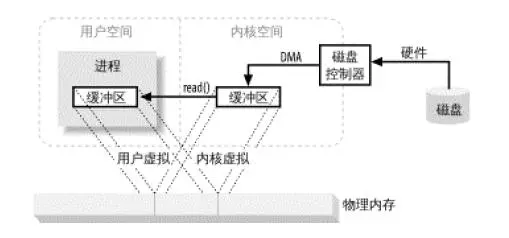
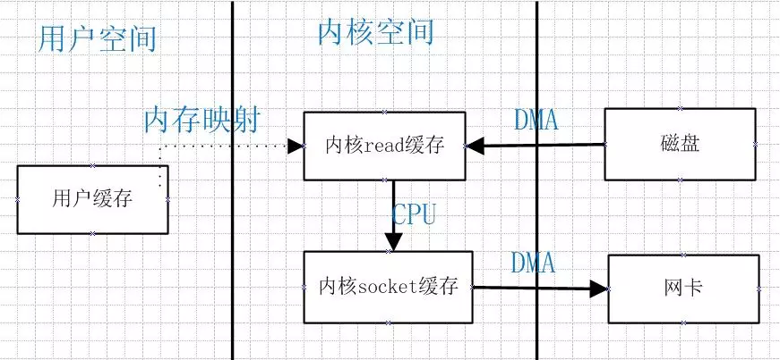
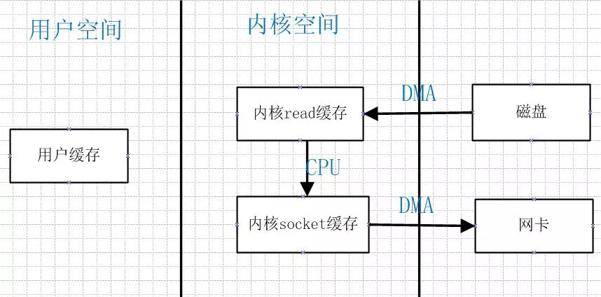

# 零拷贝
## 前言

从字面意思理解就是数据不需要来回的拷贝，大大提升了系统的性能；这个词我们也经常在java nio，netty，kafka，RocketMQ等框架中听到，经常作为其提升性能的一大亮点；下面从I/O的几个概念开始，进而在分析零拷贝。

## I/O概念

### 1.缓冲区

缓冲区是所有I/O的基础，I/O讲的无非就是把数据移进或移出缓冲区；进程执行I/O操作，就是向操作系统发出请求，让它要么把缓冲区的数据排干(写)，要么填充缓冲区(读)；下面看一个java进程发起read请求加载数据大致的流程图：

[](https://gitee.com/chenssy/blog-home/raw/master/image/201904/16a057a50ad06f61.png)

进程发起read请求之后，内核接收到read请求之后，会先检查内核空间中是否已经存在进程所需要的数据，如果已经存在，则直接把数据copy给进程的缓冲区；如果没有内核随即向磁盘控制器发出命令，要求从磁盘读取数据，磁盘控制器把数据直接写入内核read缓冲区，这一步通过DMA完成；接下来就是内核将数据copy到进程的缓冲区； 如果进程发起write请求，同样需要把用户缓冲区里面的数据copy到内核的socket缓冲区里面，然后再通过DMA把数据copy到网卡中，发送出去； 你可能觉得这样挺浪费空间的，每次都需要把内核空间的数据拷贝到用户空间中，所以零拷贝的出现就是为了解决这种问题的； 关于零拷贝提供了两种方式分别是：mmap+write方式，sendfile方式；

### 2.虚拟内存

所有现代操作系统都使用虚拟内存，使用虚拟的地址取代物理地址，这样做的好处是： 1.一个以上的虚拟地址可以指向同一个物理内存地址， 2.虚拟内存空间可大于实际可用的物理地址； 利用第一条特性可以把内核空间地址和用户空间的虚拟地址映射到同一个物理地址，这样DMA就可以填充对内核和用户空间进程同时可见的缓冲区了，大致如下图所示：

[](https://gitee.com/chenssy/blog-home/raw/master/image/201904/16a057ac4ffea504.png)

省去了内核与用户空间的往来拷贝，java也利用操作系统的此特性来提升性能，下面重点看看java对零拷贝都有哪些支持。

### 3.mmap+write方式

使用mmap+write方式代替原来的read+write方式，mmap是一种内存映射文件的方法，即将一个文件或者其它对象映射到进程的地址空间，实现文件磁盘地址和进程虚拟地址空间中一段虚拟地址的一一对映关系；这样就可以省掉原来内核read缓冲区copy数据到用户缓冲区，但是还是需要内核read缓冲区将数据copy到内核socket缓冲区，大致如下图所示：

[](https://gitee.com/chenssy/blog-home/raw/master/image/201904/16a0577f6d8dfafd.png)

### 4.sendfile方式

sendfile系统调用在内核版本2.1中被引入，目的是简化通过网络在两个通道之间进行的数据传输过程。sendfile系统调用的引入，不仅减少了数据复制，还减少了上下文切换的次数，大致如下图所示：

[](https://gitee.com/chenssy/blog-home/raw/master/image/201904/16a0577f6d03e0d0.png)

数据传送只发生在内核空间，所以减少了一次上下文切换；但是还是存在一次copy，能不能把这一次copy也省略掉，Linux2.4内核中做了改进，将Kernel buffer中对应的数据描述信息（内存地址，偏移量）记录到相应的socket缓冲区当中，这样连内核空间中的一次cpu copy也省掉了；

## Java零拷贝

### 1.MappedByteBuffer

java nio提供的FileChannel提供了map()方法，该方法可以在一个打开的文件和MappedByteBuffer之间建立一个虚拟内存映射，MappedByteBuffer继承于ByteBuffer，类似于一个基于内存的缓冲区，只不过该对象的数据元素存储在磁盘的一个文件中；调用get()方法会从磁盘中获取数据，此数据反映该文件当前的内容，调用put()方法会更新磁盘上的文件，并且对文件做的修改对其他阅读者也是可见的；下面看一个简单的读取实例，然后在对MappedByteBuffer进行分析：

```
public class MappedByteBufferTest {

   public static void main(String[] args) throws Exception {
       File file = new File("D://db.txt");
       long len = file.length();
       byte[] ds = new byte[(int) len];
       MappedByteBuffer mappedByteBuffer = new FileInputStream(file).getChannel().map(FileChannel.MapMode.READ_ONLY, 0,
               len);
       for (int offset = 0; offset < len; offset++) {
           byte b = mappedByteBuffer.get();
           ds[offset] = b;
       }
       Scanner scan = new Scanner(new ByteArrayInputStream(ds)).useDelimiter(" ");
       while (scan.hasNext()) {
           System.out.print(scan.next() + " ");
       }
   }
}
```

主要通过FileChannel提供的map()来实现映射，map()方法如下：

```
public abstract MappedByteBuffer map(MapMode mode,
                                        long position, long size)
       throws IOException;

```

分别提供了三个参数，MapMode，Position和size；分别表示：

- MapMode：映射的模式，可选项包括：READ\_ONLY，READ\_WRITE，PRIVATE；
- Position：从哪个位置开始映射，字节数的位置；
- Size：从position开始向后多少个字节；

重点看一下MapMode，请两个分别表示只读和可读可写，当然请求的映射模式受到Filechannel对象的访问权限限制，如果在一个没有读权限的文件上启用READ_ONLY，将抛出NonReadableChannelException；PRIVATE模式表示写时拷贝的映射，意味着通过put()方法所做的任何修改都会导致产生一个私有的数据拷贝并且该拷贝中的数据只有MappedByteBuffer实例可以看到；该过程不会对底层文件做任何修改，而且一旦缓冲区被施以垃圾收集动作（garbage collected），那些修改都会丢失；大致浏览一下map()方法的源码：

```
public MappedByteBuffer map(MapMode mode, long position, long size)
       throws IOException
   {
           ...省略...
           int pagePosition = (int)(position % allocationGranularity);
           long mapPosition = position - pagePosition;
           long mapSize = size + pagePosition;
           try {
               // If no exception was thrown from map0, the address is valid
               addr = map0(imode, mapPosition, mapSize);
           } catch (OutOfMemoryError x) {
               // An OutOfMemoryError may indicate that we've exhausted memory
               // so force gc and re-attempt map
               System.gc();
               try {
                   Thread.sleep(100);
               } catch (InterruptedException y) {
                   Thread.currentThread().interrupt();
               }
               try {
                   addr = map0(imode, mapPosition, mapSize);
               } catch (OutOfMemoryError y) {
                   // After a second OOME, fail
                   throw new IOException("Map failed", y);
               }
           }

           // On Windows, and potentially other platforms, we need an open
           // file descriptor for some mapping operations.
           FileDescriptor mfd;
           try {
               mfd = nd.duplicateForMapping(fd);
           } catch (IOException ioe) {
               unmap0(addr, mapSize);
               throw ioe;
           }

           assert (IOStatus.checkAll(addr));
           assert (addr % allocationGranularity == 0);
           int isize = (int)size;
           Unmapper um = new Unmapper(addr, mapSize, isize, mfd);
           if ((!writable) || (imode == MAP_RO)) {
               return Util.newMappedByteBufferR(isize,
                                                addr + pagePosition,
                                                mfd,
                                                um);
           } else {
               return Util.newMappedByteBuffer(isize,
                                               addr + pagePosition,
                                               mfd,
                                               um);
           }
    }
```

大致意思就是通过native方法获取内存映射的地址，如果失败，手动gc再次映射；最后通过内存映射的地址实例化出MappedByteBuffer，MappedByteBuffer本身是一个抽象类，其实这里真正实例话出来的是DirectByteBuffer；

### 2.DirectByteBuffer

DirectByteBuffer继承于MappedByteBuffer，从名字就可以猜测出开辟了一段直接的内存，并不会占用jvm的内存空间；上一节中通过Filechannel映射出的MappedByteBuffer其实际也是DirectByteBuffer，当然除了这种方式，也可以手动开辟一段空间：

```
ByteBuffer directByteBuffer = ByteBuffer.allocateDirect(100);
```

如上开辟了100字节的直接内存空间；

### 3.Channel-to-Channel传输

经常需要从一个位置将文件传输到另外一个位置，FileChannel提供了transferTo()方法用来提高传输的效率，首先看一个简单的实例：

```
public class ChannelTransfer {
   public static void main(String[] argv) throws Exception {
       String files[]=new String[1];
       files[0]="D://db.txt";
       catFiles(Channels.newChannel(System.out), files);
   }

   private static void catFiles(WritableByteChannel target, String[] files)
           throws Exception {
       for (int i = 0; i < files.length; i++) {
           FileInputStream fis = new FileInputStream(files[i]);
           FileChannel channel = fis.getChannel();
           channel.transferTo(0, channel.size(), target);
           channel.close();
           fis.close();
       }
   }
}
```

通过FileChannel的transferTo()方法将文件数据传输到System.out通道，接口定义如下：

```
public abstract long transferTo(long position, long count,
                                   WritableByteChannel target)
       throws IOException;
```

几个参数也比较好理解，分别是开始传输的位置，传输的字节数，以及目标通道；transferTo()允许将一个通道交叉连接到另一个通道，而不需要一个中间缓冲区来传递数据； 注：这里不需要中间缓冲区有两层意思：第一层不需要用户空间缓冲区来拷贝内核缓冲区，另外一层两个通道都有自己的内核缓冲区，两个内核缓冲区也可以做到无需拷贝数据；

## Netty零拷贝

netty提供了零拷贝的buffer，在传输数据时，最终处理的数据会需要对单个传输的报文，进行组合和拆分，Nio原生的ByteBuffer无法做到，netty通过提供的Composite(组合)和Slice(拆分)两种buffer来实现零拷贝；看下面一张图会比较清晰：

[](https://gitee.com/chenssy/blog-home/raw/master/image/201904/16a0577f6f3da1c2.png)

TCP层HTTP报文被分成了两个ChannelBuffer，这两个Buffer对我们上层的逻辑(HTTP处理)是没有意义的。 但是两个ChannelBuffer被组合起来，就成为了一个有意义的HTTP报文，这个报文对应的ChannelBuffer，才是能称之为”Message”的东西，这里用到了一个词”Virtual Buffer”。

可以看一下netty提供的CompositeChannelBuffer源码：

```
public class CompositeChannelBuffer extends AbstractChannelBuffer {

   private final ByteOrder order;
   private ChannelBuffer[] components;
   private int[] indices;
   private int lastAccessedComponentId;
   private final boolean gathering;

   public byte getByte(int index) {
       int componentId = componentId(index);
       return components[componentId].getByte(index - indices[componentId]);
   }
   ...省略...
```

components用来保存的就是所有接收到的buffer，indices记录每个buffer的起始位置，lastAccessedComponentId记录上一次访问的ComponentId；CompositeChannelBuffer并不会开辟新的内存并直接复制所有ChannelBuffer内容，而是直接保存了所有ChannelBuffer的引用，并在子ChannelBuffer里进行读写，实现了零拷贝。

## 其他零拷贝

RocketMQ的消息采用顺序写到commitlog文件，然后利用consume queue文件作为索引；RocketMQ采用零拷贝mmap+write的方式来回应Consumer的请求； 同样kafka中存在大量的网络数据持久化到磁盘和磁盘文件通过网络发送的过程，kafka使用了sendfile零拷贝方式；

## 总结

零拷贝如果简单用java里面对象的概率来理解的话，其实就是使用的都是对象的引用，每个引用对象的地方对其改变就都能改变此对象，永远只存在一份对象。